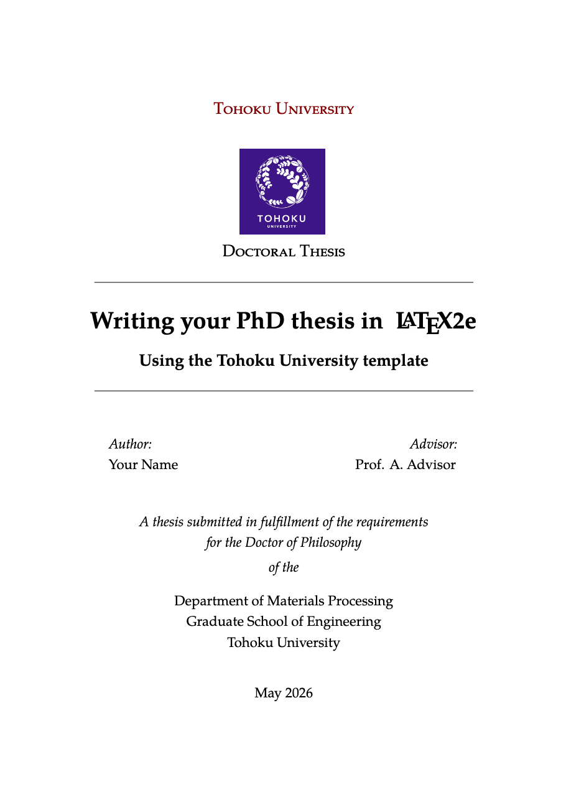

Tohoku University PhD thesis template
========================

## Author(s)
*   Tao Zhang

## Inspirations/Based on
* Masters/Doctoral Thesis for Tohoku University students (Tran Quang-Thanh) [(https://thanhqtran.github.io)](https://thanhqtran.github.io)
* CUED PhD thesis template [https://github.com/kks32/phd-thesis-template](https://github.com/kks32/phd-thesis-template)

## Preview

--------------------------------------------------------------------------------

## Building your thesis - XeLaTeX

### Using latexmk (Unix/Linux/Windows)

This template supports `XeLaTeX` compilation chain. To generate  PDF run

    latexmk -xelatex thesis.tex
    makeindex thesis.nlo -s nomencl.ist -o thesis.nls
    latexmk -xelatex -g thesis.tex

## Building your thesis - LuaLaTeX

### Using latexmk (Unix/Linux/Windows)

This template supports `LuaLaTeX` compilation chain. To generate  PDF run

    latexmk -pdflatex=lualatex -pdf thesis.tex

## Building your thesis - LaTeX / PDFLaTeX

### Using latexmk (Unix/Linux/Windows)

This template supports `latexmk`. To generate DVI, PS and PDF run

    latexmk -dvi -ps -pdf thesis.tex

### Using the make file (Unix/Linux)

The template supports PDF, DVI and PS formats. All three formats can be generated
with the provided `Makefile`.

To build the `PDF` version of your thesis, run:

    make

This build procedure uses `pdflatex` with `bibtex` and will produce `thesis.pdf`.
To use `pdflatex` with `biblatex`, you should run:

    make BIB_STRATEGY=biblatex

To use `XeLaTeX`, you should run:

    make BUILD_STRATEGY=xelatex

or with `biblatex`

    make BUILD_STRATEGY=xelatex BIB_STRATEGY=biblatex

To use `LuaLaTeX`, you should run:

    make BUILD_STRATEGY=lualatex

or with `biblatex`

    make BUILD_STRATEGY=lualatex BIB_STRATEGY=biblatex

To produce `DVI` and `PS` versions of your document, you should run:

    make BUILD_STRATEGY=latex

This will use the `latex` command to build the document and will produce
`thesis.dvi`, `thesis.ps` and `thesis.pdf` documents. You will need psutils installed

Clean unwanted files

To clean unwanted clutter (all LaTeX auto-generated files), run:

    make clean

__Note__: the `Makefile` itself is take from and maintained at
[here](http://code.google.com/p/latex-makefile/).

### Shell script for PDFLaTeX (Unix/Linux)

Usage: `sh ./compile-thesis.sh [OPTIONS] [filename]`

[option]  compile: Compiles the PhD Thesis

[option]  clean: removes temporary files - no filename required

### Using the batch file on Windows OS (PDFLaTeX)

*    Open command prompt and navigate to the directory with the tex file. Run:

    `compile-thesis-windows.bat`.

*    Alternatively, double click on `compile-thesis-windows.bat`

-------------------------------------------------------------------------------

